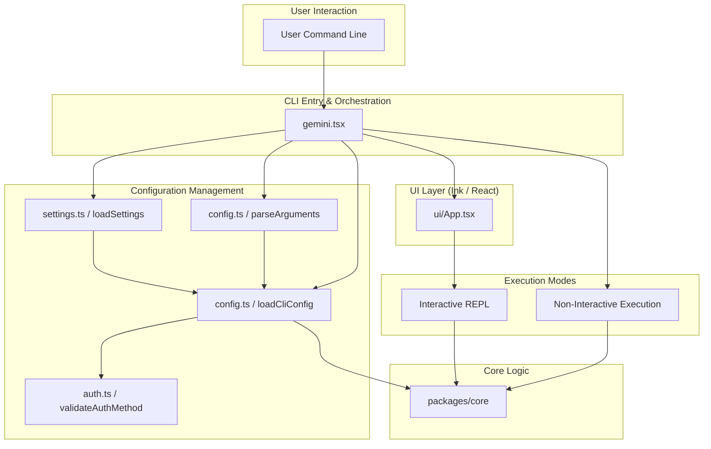
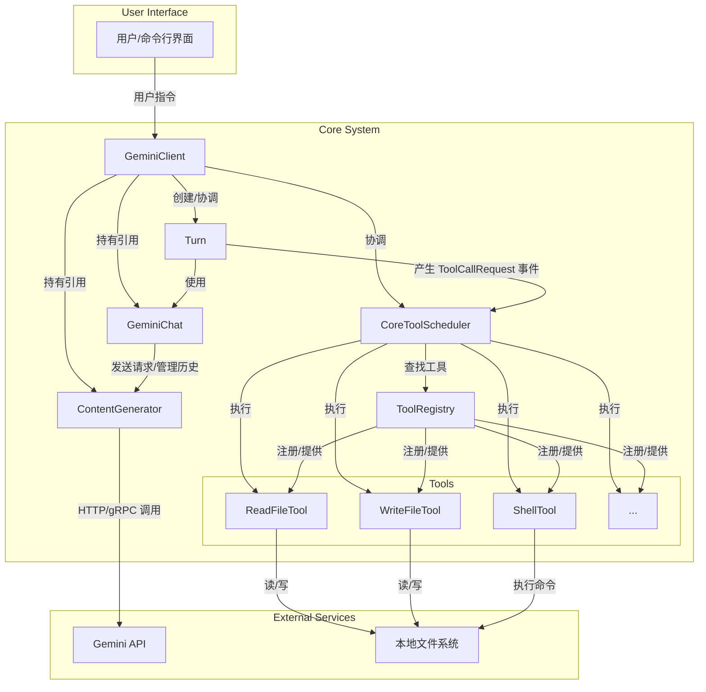
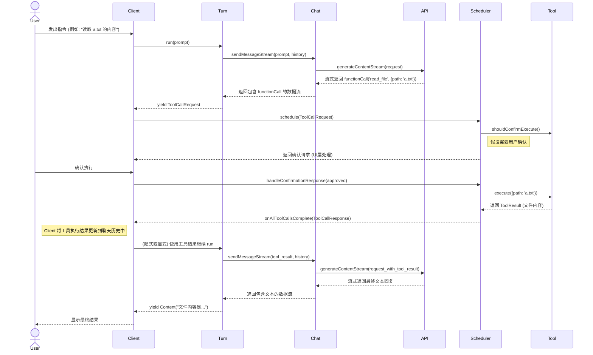

# Gemini CLI Artitecture

本文档旨在记录对Gemini CLI的系统架构与实现的理解，旨在帮助用户或开发者理解其内部工作原理。

## Overview

Gemini CLI采用了monorepo结构，在单一仓库内管理着多个独立但相关的包 。其中，关键的两个包是 **packages/cli** 和 **packages/core** 。

**packages/cli**: 包基于Ink（一个用于终端应用的React渲染器）构建，负责完整的用户体验：捕获用户输入、渲染动态输出以及管理对话的视觉状态 。  

**packages/core** : 是Agent的引擎。包含提示词构建、对话管理、工具编排以及与Gemini API交互的核心逻辑 。这意味着核心的Agent逻辑是与用户界面无关的。

## CLI Package

`packages/cli` 负责提供用户交互界面和命令行体验。它解析用户输入，管理配置，并调用 `core` 包来执行核心AI逻辑。以下是CLI包的架构图：

### CLI 组件说明

- **gemini.tsx**: CLI应用的入口点。它负责解析命令行参数、加载设置和扩展、初始化主 `Config` 对象，并根据参数启动交互式或非交互式模式。
- **config/config.ts**: 定义和解析CLI参数（使用 `yargs`），并加载传递给核心逻辑的主 `Config` 对象。
- **config/settings.ts**: 管理系统、用户和工作区级别的分层设置，从JSON文件和环境变量中加载配置。
- **config/auth.ts**: 处理和验证不同的身份验证方法，如 `Google Login`、`Cloud Shell`、`GEMINI_API_KEY` 等。
- **ui/App.tsx**: 使用 `React` 和 `Ink` 渲染交互式CLI的用户界面，管理主题、显示提示和响应。
- **Execution Modes**: CLI支持两种主要模式：一个用于实时对话的交互式REPL（Read-Eval-Print Loop）和一个用于直接执行命令的非交互式模式。

## Core Package

### Core 组件说明

- GeminiClient: 顶层协调器，处理用户请求，管理会话生命周期。
- GeminiChat: 负责维护对话历史记录，并与 - ContentGenerator 交互。
- Turn: 代表一个完整的交互轮次，从用户输入到模型产生最终回复或工具调用。
- CoreToolScheduler: 接收 Turn 发出的工具调用请求，并负责调度、确认和执行这些工具。
- ToolRegistry: 存储所有可用的工具，供 Scheduler 查询。
- Tools: (如 ReadFileTool) 实际执行具体操作的模块。
- ContentGenerator: 抽象层，负责与后端的 Gemini API 进行实际的通信。

## System Behavior

### 流程说明

1. 用户发起: 用户输入需要与文件系统交互的指令。
模型决策: Client -> Turn -> Chat -> API 的调用链将请求发送给模型。模型分析后决定不直接回答，而是调用 read_file 工具。
2. 工具调度: Turn 捕获到模型的工具调用意图，并通知 Scheduler。
3. 确认与执行: Scheduler 管理工具的执行流程，包括（可选的）用户确认环节，然后调用具体的 ReadFileTool。
4. 结果反馈: 工具的执行结果被包装后，通过 Client 添加到 Chat 的历史记录中。
5. 综合回答: Turn 再次与 API 通信，这次附上了工具的执行结果。模型根据这个新信息，生成最终的、面向用户的自然语言回答。
6. 返回用户: Client 将最终的文本回复流式传输给用户界面。
