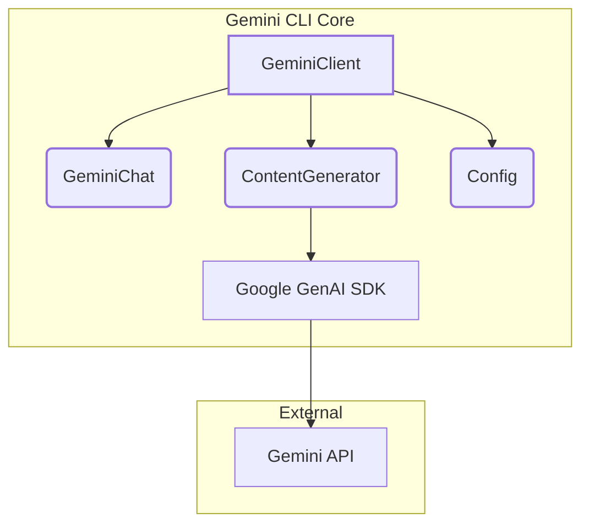
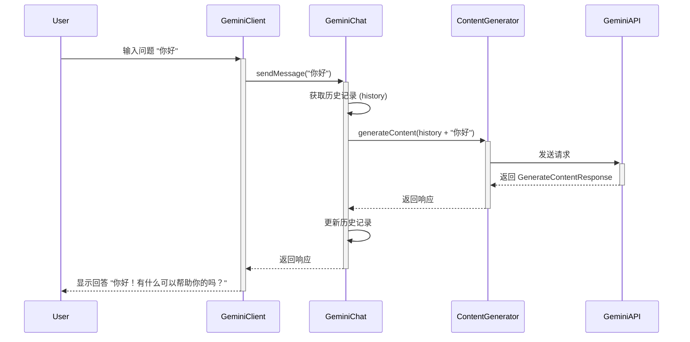
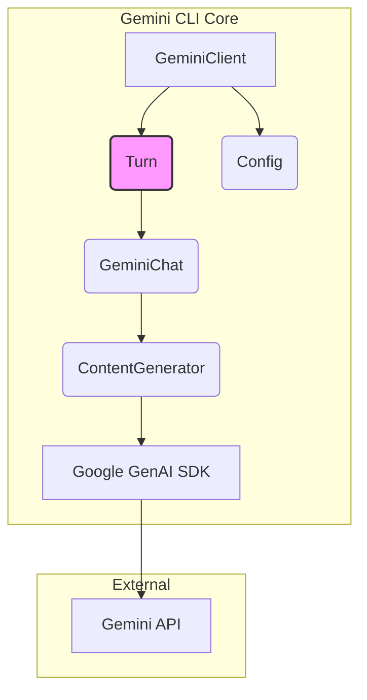
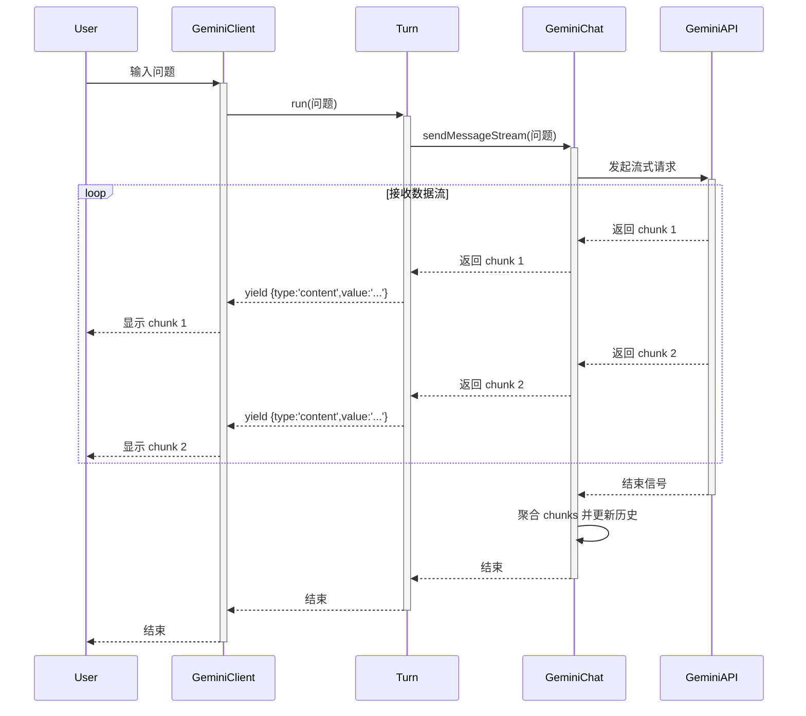
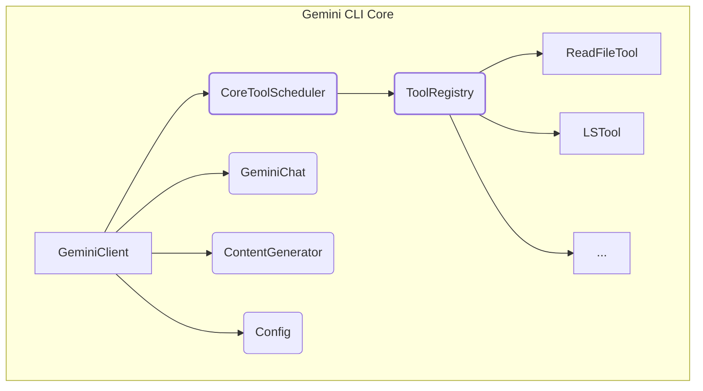
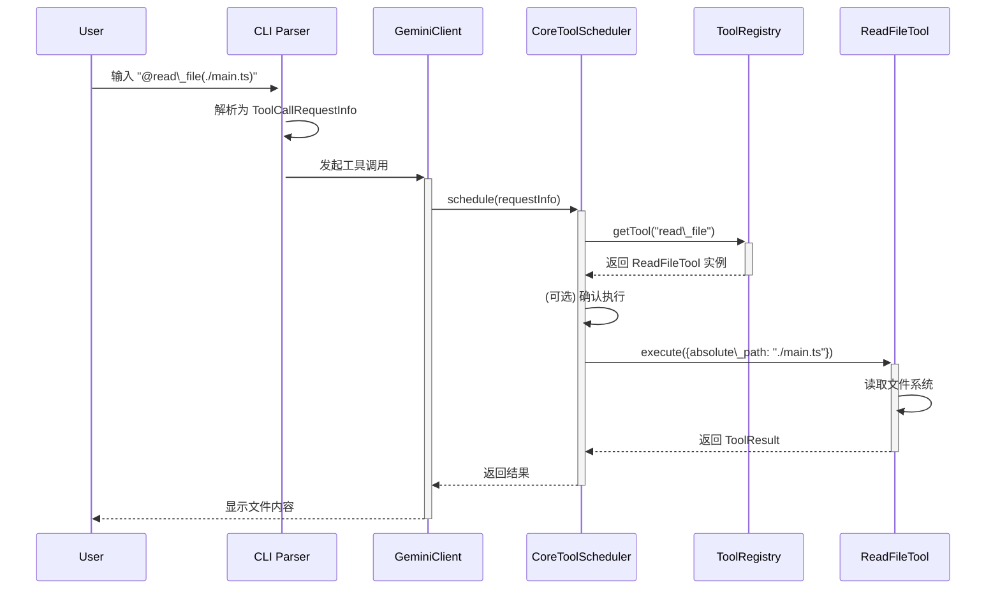
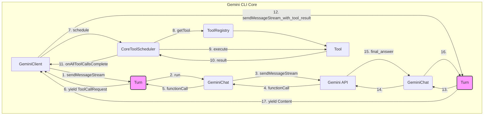
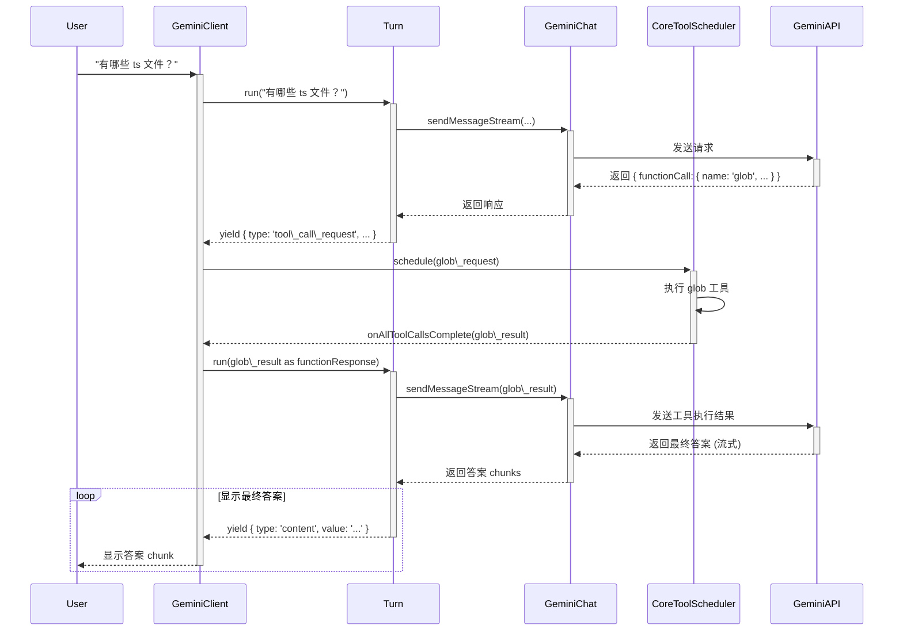
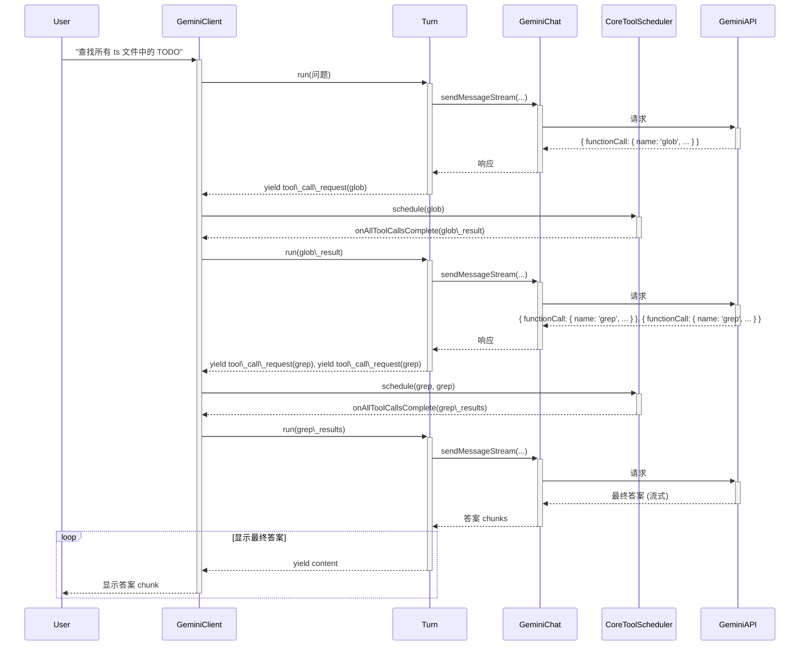

# **Gemini CLI 核心工作原理解析**

本文档旨在深入解析 Gemini CLI（命令行界面）的核心工作原理。我们将从最基础的聊天功能入手，逐步深入到流式输出、被动工具调用、主动工具调用乃至多轮主动工具调用等高级功能。通过这种渐进式的方式，帮助软件工程师全面理解该代理系统的架构、模块及具体实现。

## **1. 基础聊天 (Basic Chat)**

最基本的功能是与 Gemini 模型进行一次简单的问答。用户输入一个问题，CLI 将其发送给模型，然后等待并显示完整的回答。

### **1.1 功能介绍**

用户在命令行中输入一段文本作为提示（Prompt），CLI 将该提示发送给 Gemini API，API 返回一个包含模型生成内容的响应，CLI 将响应中的文本提取出来并展示给用户。这是一个典型的“请求-响应”模式。

### **1.2 涉及组件介绍**

在基础聊天场景下，主要涉及以下几个核心组件：

* **Config**: 全局配置对象，负责管理 API Key、模型名称 (gemini-pro)、代理设置等所有配置信息。它在应用启动时被初始化，并贯穿整个生命周期。
* **ContentGenerator**: 内容生成器，是与 Google GenAI API 直接交互的底层封装。它根据 Config 中指定的认证方式（API Key, OAuth 等）创建，并提供了 generateContent 等方法来调用 API。
* **GeminiClient**: Gemini 客户端，是核心业务逻辑的封装层。它持有 Config 和 ContentGenerator 的实例，并负责初始化和管理聊天会话。
* **GeminiChat**: 聊天会话管理器。它维护着一个完整的对话历史（history），并提供了 sendMessage 方法。此方法会自动将用户的最新消息和之前的对话历史拼接起来，一同发送给模型，从而实现上下文感知。

#### **架构图**

### **1.3 工作流程介绍**

基础聊天的工作流程清晰明了，可以概括为以下几个步骤：

1. **初始化**: CLI 启动时，首先创建 Config 对象，然后基于配置创建 ContentGenerator 和 GeminiClient。GeminiClient 内部会进一步创建一个 GeminiChat 实例来管理会话。
2. **用户输入**: 用户在命令行输入问题。
3. **发送消息**: GeminiClient 调用 GeminiChat.sendMessage() 方法。
4. **构建请求**: GeminiChat 获取当前完整的对话历史，并将用户的新输入追加到历史末尾，形成一个 Content[] 数组。
5. **调用 API**: GeminiChat 通过 ContentGenerator.generateContent() 方法，将完整的 Content[] 发送给 Gemini API。
6. **接收响应**: ContentGenerator 接收到来自 API 的 GenerateContentResponse。
7. **更新历史**: GeminiChat 从响应中提取出模型的回答（role: 'model' 的 Content），并将其与用户的输入一同追加到内部的 history 数组中，为下一次对话做准备。
8. **显示结果**: GeminiClient 将模型回答的文本内容返回给上层UI，最终显示在用户的终端上。

#### **时序图**

## **2. 流式输出 (Streaming Chat)**

为了提升用户体验，避免在等待模型生成完整答案时的长时间空白，Gemini CLI 支持流式输出。模型会边生成边将内容以数据块（chunks）的形式返回。

### **2.1 功能介绍**

当用户发送请求后，CLI 不会等待整个响应完成，而是立即开始接收从 API 发送回来的一个个文本片段。每收到一个片段，就立即在终端上显示出来，给用户一种实时生成的感觉。

### **2.2 涉及组件介绍**

流式输出在基础聊天的组件之上，主要的变化在于 GeminiChat 和 GeminiClient 的交互方式。

* **GeminiChat.sendMessageStream()**: GeminiChat 提供了这个专门用于流式调用的方法。它返回一个异步生成器 (AsyncGenerator\<GenerateContentResponse\>)。
* **Turn**: 这是一个新的核心类，用于管理一个完整的“回合”。在流式场景下，GeminiClient 会创建一个 Turn 实例，并调用其 run() 方法。run() 方法内部会调用 GeminiChat.sendMessageStream()，并对返回的数据流进行处理和转发。

#### **架构图**

架构与基础聊天基本一致，但数据流向有所不同，强调了从 API 到客户端的持续数据流。

### **2.3 工作流程介绍**

1. **发起流式请求**: 用户输入问题后，GeminiClient 调用 sendMessageStream() 方法。
2. **创建 Turn**: GeminiClient 内部创建一个 Turn 实例。
3. **运行 Turn**: GeminiClient 调用 turn.run()，并将用户输入传递进去。
4. **调用流式 API**: turn.run() 内部调用 GeminiChat.sendMessageStream()，后者又通过 ContentGenerator 调用 generateContentStream() 方法，向 Gemini API 发起一个流式请求。
5. **处理数据流**: turn.run() 使用 for await...of 循环来迭代 sendMessageStream 返回的异步生成器。
6. **分发事件**: 每当从数据流中接收到一个数据块（GenerateContentResponse），Turn 会将其包装成一个 ServerGeminiStreamEvent（类型为 GeminiEventType.Content），并通过 yield 关键字将其返回给 GeminiClient。
7. **实时显示**: GeminiClient 的 sendMessageStream 方法同样是一个异步生成器。它接收到 Turn yield 的 Content 事件后，立即 yield 给上层调用者，最终由 UI 实时渲染到终端。
8. **历史更新**: 当数据流结束时，GeminiChat 会将所有接收到的数据块聚合成一个完整的模型响应，并更新到对话历史中。

#### **时序图**

## **3. 被动工具调用 (Passive Tool Call)**

被动工具调用指的是用户通过特定语法（例如 @read\_file(path/to/file.txt)）明确指示 CLI 执行一个已注册的工具。

### **3.1 功能介绍**

用户可以在其提示中嵌入一个或多个工具调用指令。CLI 会解析这些指令，执行相应的本地工具（如读文件、列目录等），并将工具的执行结果返回给用户。在这个阶段，工具的执行结果不会被送回给模型。

### **3.2 涉及组件介绍**

这个功能引入了工具管理和调度的核心组件：

* **Tool / BaseTool**: 所有工具的基类。每个具体的工具（如 ReadFileTool）都继承自 BaseTool，并实现其核心方法，如 execute()。每个工具都包含一个 JSON Schema，用于定义其参数。
* **ToolRegistry**: 工具注册中心。它在启动时被创建，负责发现和注册所有可用的核心工具（ReadFileTool, LSTool 等）。它提供 getTool() 方法来根据名称查找工具。
* **CoreToolScheduler**: 工具调度器。当需要执行工具时，CoreToolScheduler 负责接收工具调用请求，验证参数，管理执行生命周期（如等待用户确认、执行、处理成功或失败），并返回结果。

#### **架构图**

### **3.3 工作流程介绍**

1. **用户输入**: 用户输入包含工具调用语法的提示，例如 "请帮我读取 @read\_file(./src/main.ts) 的内容"。
2. **解析**: CLI 的上层（通常是 commander 或类似的库）会解析这个输入，识别出 @read\_file(...) 是一个工具调用请求。
3. **创建请求**: 解析器将工具名称 read\_file 和参数 { "absolute\_path": "./src/main.ts" } 包装成一个 ToolCallRequestInfo 对象。
4. **调度执行**: GeminiClient 将这个 ToolCallRequestInfo 对象传递给 CoreToolScheduler.schedule() 方法。
5. **查找工具**: CoreToolScheduler 从 ToolRegistry 中查找名为 read\_file 的工具实例。
6. **验证与确认 (可选)**: 调度器会调用工具的 shouldConfirmExecute() 方法。对于有风险的操作（如写文件），这会触发一个用户确认流程。对于读文件这类只读操作，通常会跳过确认。
7. **执行工具**: 确认通过后，CoreToolScheduler 调用 ReadFileTool.execute() 方法，并传入参数。
8. **执行本地操作**: ReadFileTool 执行实际的文件读取逻辑，与本地文件系统交互。
9. **返回结果**: execute() 方法返回一个 ToolResult 对象，其中包含 llmContent（给模型看的内容）和 returnDisplay（给用户看的内容）。
10. **显示结果**: CoreToolScheduler 将 ToolResult 的 returnDisplay 部分返回，最终显示在用户的终端上。

#### **时序图**

## **4. 主动工具调用 (Active Tool Call)**

这是 Gemini 作为 Agent（代理）能力的核心体现。模型不再是被动地响应，而是能够根据用户的模糊问题，主动决定是否需要以及需要调用哪个工具来获取额外信息，以更好地回答问题。

### **4.1 功能介绍**

用户提出一个需要外部信息才能回答的问题（例如“当前目录下有哪些 ts 文件？”）。模型在理解问题后，不会直接回答，而是生成一个特殊的响应，其中包含一个或多个 functionCall 请求。CLI 接收到这个请求后，执行相应的工具，并将执行结果返回给模型。模型再根据工具返回的信息，生成最终的自然语言回答。

### **4.2 涉及组件介绍**

这个流程联动了之前提到的所有核心组件，并以 Turn 为中心进行串联。

* **Turn**: 它的作用变得至关重要。Turn 不仅处理 Content 事件，还会检查模型响应中是否包含 functionCall。如果包含，它会生成 ToolCallRequest 事件。
* **GeminiClient**: 作为总指挥，它消费 Turn 生成的事件流。当收到 Content 事件时，它将其显示给用户；当收到 ToolCallRequest 事件时，它会启动 CoreToolScheduler 来处理。
* **CoreToolScheduler**: 负责执行模型请求的工具调用，并在所有工具执行完毕后，通过回调通知 GeminiClient。
* **GeminiChat**: 负责将工具的执行结果（functionResponse）包装成 Content 对象，并作为新的对话历史发送回模型。

#### **架构图**

这是一个完整的闭环系统，展示了模型与本地工具之间的交互。

### **4.3 工作流程介绍**

这是一个两阶段的过程：

**阶段一：模型请求工具调用**

1. **用户提问**: 用户输入 "当前项目下有哪些 ts 文件？"。
2. **首次调用 API**: GeminiClient \-\> Turn \-\> GeminiChat 将问题发送给 Gemini API。
3. **模型返回 Function Call**: 模型分析后认为需要列出文件，于是返回一个包含 functionCall 的 GenerateContentResponse，例如 { functionCall: { name: 'glob', args: { pattern: '\*\*/\*.ts' } } }。
4. **生成工具调用请求**: Turn 在 run() 方法中检测到这个 functionCall，将其转换为 ToolCallRequestInfo，并 yield 一个类型为 GeminiEventType.ToolCallRequest 的事件。

**阶段二：执行工具并返回结果给模型**

5. **调度工具**: GeminiClient 接收到 ToolCallRequest 事件，立即调用 CoreToolScheduler.schedule() 来执行 glob 工具。
6. **执行并获取结果**: CoreToolScheduler 执行 GlobTool，得到文件列表字符串。
7. **结果回调**: 当所有（这里只有一个）工具调用完成后，CoreToolScheduler 会触发 onAllToolCallsComplete 回调，将所有工具的 ToolCallResponseInfo 列表返回给 GeminiClient。
8. **构建 Function Response**: GeminiClient 将 ToolCallResponseInfo 转换为 Part 数组，每个 Part 都是一个 functionResponse。
9. **再次调用 API**: GeminiClient 再次调用 sendMessageStream，但这次的输入是上一步生成的 functionResponse 数组。这相当于告诉模型：“你之前请求的 glob 工具我已经执行了，结果是这些文件列表。”
10. **模型生成最终答案**: 模型接收到工具的执行结果后，将其理解并用自然语言组织起来，生成最终的回答，例如：“好的，在当前项目中，我找到了以下 TypeScript 文件：...（文件列表）...”。
11. **流式输出最终答案**: 这个最终答案会通过流式的方式返回给 Turn，再由 Turn yield Content 事件给 GeminiClient，最终显示给用户。

#### **时序图**

## **5. 多轮主动工具调用 (Multi-Turn Active Tool Call)**

在某些复杂场景下，模型可能需要执行多个工具，甚至是按顺序执行多个工具（后一个工具的输入依赖于前一个的输出），才能完成用户的任务。

### **5.1 功能介绍**

用户提出一个复杂任务，例如“找到所有 ts 文件中包含 'TODO' 字符串的行，并告诉我它们的文件名和行号”。这个任务需要：

1. 先用 glob 找到所有 .ts 文件。
2. 再对找到的每一个文件，使用 grep 或 read\_file 查找包含 'TODO' 的行。

模型需要能够自主地规划并依次发起这两个（或多个）工具调用。

### **5.2 涉及组件介绍**

所涉及的组件与主动工具调用完全相同。这里的复杂性体现在工作流程的循环和状态管理上，而不是组件本身。GeminiClient 的 sendMessageStream 方法被设计为可递归的，它有一个 turns 参数来控制最大递归深度，防止无限循环。

### **5.3 工作流程介绍**

工作流程是主动工具调用流程的循环或递归版本。

1. **用户提出复杂问题**。
2. **第一次模型调用**: 模型返回第一个工具调用请求，例如 glob('\*\*/\*.ts')。
3. **第一次工具执行**: GeminiClient 通过 CoreToolScheduler 执行 glob，得到文件列表。
4. **第二次模型调用**: GeminiClient 将 glob 的结果作为 functionResponse 发回给模型。
5. **模型进行下一步规划**: 模型接收到文件列表后，发现任务还没完成。于是，它根据文件列表生成了第二个（或一批）工具调用请求，例如为每个文件都生成一个 grep('TODO', file\_path) 的请求。
6. **第二次工具执行**: GeminiClient 再次调用 CoreToolScheduler 来执行所有的 grep 请求。
7. **第三次模型调用**: GeminiClient 将所有 grep 的结果汇总后，再次作为 functionResponse 发回给模型。
8. **生成最终答案**: 此时，模型已经拥有了所有必要的信息，于是生成最终的、汇总了所有 grep 结果的自然语言回答。
9. **checkNextSpeaker**: 在一个 Turn 结束后，如果模型没有发出工具调用，GeminiClient 会调用 checkNextSpeaker 实用函数。它会向模型发送一个简短的请求，询问对话是否应该继续。如果模型认为自己还有话要说（例如，在完成一个多步任务后进行总结），它会返回 { "next\_speaker": "model" }。GeminiClient 收到后，会自动发送一个 "Please continue." 的提示，触发模型的下一轮发言，从而实现更连贯的对话。

这个循环会一直持续，直到模型认为任务已经完成，不再返回 functionCall，而是返回最终的自然语言答案。

#### **时序图**

通过以上五个层层递进的章节，我们详细剖析了 Gemini CLI 从一个简单的聊天工具，演变为一个强大的、能够自主规划和执行复杂任务的智能代理的全过程。其模块化的设计、清晰的事件驱动流程以及强大的工具调用机制，共同构成了这个系统的核心竞争力。