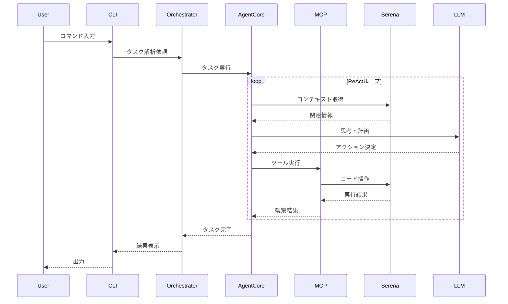

# アーキテクチャ設計書

## システム概要

@akiojin/agentsは、MCPプロトコルをベースとした拡張可能な自律型コーディングエージェントシステムです。Bunランタイム上で動作し、複数のLLMプロバイダーと並列タスク処理をサポートします。

## アーキテクチャ概観

```
┌────────────────────────────────────────────────────┐
│                   User Interface                    │
│         (CLI: Interactive / Batch Mode)            │
└────────────────────┬───────────────────────────────┘
                     │
┌────────────────────▼───────────────────────────────┐
│              Agent Orchestrator                     │
│         (Task Planning & Coordination)             │
└────────────────────┬───────────────────────────────┘
                     │
        ┌────────────┼────────────┐
        │            │            │
┌───────▼──────┐ ┌──▼───────┐ ┌─▼──────────┐
│ Agent Core   │ │ Task     │ │ Memory     │
│ (ReAct Loop) │ │ Queue    │ │ (Serena)   │
└───────┬──────┘ └──┬───────┘ └─┬──────────┘
        │            │            │
┌───────▼────────────▼────────────▼──────────────────┐
│             MCP Protocol Layer                      │
│         (Tool Registration & Execution)            │
└────────────────────┬───────────────────────────────┘
                     │
     ┌───────────────┼───────────────┐
     │               │               │
┌────▼─────┐ ┌──────▼──────┐ ┌─────▼──────┐
│ Serena   │ │ File System │ │ Custom     │
│ MCP Tool │ │ MCP Tool    │ │ MCP Tools  │
└──────────┘ └─────────────┘ └────────────┘
                     │
┌────────────────────▼───────────────────────────────┐
│           LLM Provider Abstraction                 │
└────────────────────┬───────────────────────────────┘
                     │
   ┌─────────────────┼─────────────────┐
   │                 │                 │
┌──▼──────┐ ┌───────▼──────┐ ┌───────▼──────┐
│ Local   │ │ OpenAI       │ │ Anthropic    │
│ (GPT-OSS)│ │ (GPT-4/3.5) │ │ (Claude 3)   │
└─────────┘ └──────────────┘ └──────────────┘
```

## コンポーネント詳細

### 1. User Interface Layer

#### CLI Interface

```typescript
interface CLIOptions {
  mode: 'interactive' | 'batch';
  task?: string;
  config?: string;
  provider?: LLMProvider;
  model?: string;
  parallel?: number;
}
```

**主要機能:**

- コマンドライン引数の解析
- インタラクティブプロンプトの管理
- 進捗表示とログ出力
- エラーハンドリングとユーザーフィードバック

### 2. Agent Orchestrator

**責務:**

- タスクの受付と解析
- サブタスクへの分解
- 並列実行可能なタスクの識別
- エージェント間の調整

```typescript
class AgentOrchestrator {
  async planTask(task: string): Promise<TaskPlan> {
    // タスクを解析し、実行計画を生成
  }

  async executeParallel(tasks: Task[]): Promise<Result[]> {
    // 並列実行可能なタスクを同時実行
  }
}
```

### 3. Agent Core (ReAct Pattern)

**ReActループの実装:**

```typescript
interface ReActStep {
  thought: string; // 思考
  action: MCPAction; // 実行するアクション
  observation: string; // 実行結果の観察
}

class AgentCore {
  async execute(task: Task): Promise<Result> {
    const steps: ReActStep[] = [];

    while (!isComplete(task)) {
      const thought = await this.think(task, steps);
      const action = await this.decideAction(thought);
      const observation = await this.executeAction(action);

      steps.push({ thought, action, observation });
    }

    return this.synthesizeResult(steps);
  }
}
```

### 4. Task Queue System

**並列処理の管理:**

```typescript
class TaskQueue {
  private queue: PriorityQueue<Task>;
  private executing: Map<string, Task>;
  private maxParallel: number = 10;

  async process(): Promise<void> {
    while (this.queue.length > 0) {
      const availableSlots = this.maxParallel - this.executing.size;
      const tasks = this.queue.takeParallel(availableSlots);

      await Promise.all(tasks.map((task) => this.executeTask(task)));
    }
  }
}
```

### 5. Memory System (Serena MCP)

**Serenaを活用したコンテキスト管理:**

```typescript
interface SerenaMemory {
  // プロジェクト全体のシンボル情報
  symbols: SymbolIndex;

  // ファイルの依存関係
  dependencies: DependencyGraph;

  // 編集履歴
  history: EditHistory;

  // セッション情報
  session: SessionContext;
}

class MemoryManager {
  private serena: SerenaMCP;

  async getRelevantContext(task: Task): Promise<Context> {
    // Serenaを使用して関連するコンテキストを取得
    const symbols = await this.serena.findSymbols(task.query);
    const references = await this.serena.findReferences(symbols);

    return this.buildContext(symbols, references);
  }

  async updateMemory(action: Action, result: Result): void {
    // 実行結果をメモリに反映
    await this.serena.updateSymbolIndex(result.changes);
  }
}
```

### 6. MCP Protocol Layer

**MCPツールの管理と実行:**

```typescript
interface MCPTool {
  name: string;
  description: string;
  inputSchema: JSONSchema;
  execute: (params: any) => Promise<any>;
}

class MCPManager {
  private tools: Map<string, MCPTool> = new Map();

  registerTool(tool: MCPTool): void {
    this.tools.set(tool.name, tool);
  }

  async executeTool(name: string, params: any): Promise<any> {
    const tool = this.tools.get(name);
    if (!tool) throw new Error(`Tool ${name} not found`);

    // 入力検証
    validateSchema(params, tool.inputSchema);

    // ツール実行
    return await tool.execute(params);
  }

  // 並列ツール実行
  async executeParallel(actions: MCPAction[]): Promise<any[]> {
    return Promise.all(actions.map((action) => this.executeTool(action.tool, action.params)));
  }
}
```

### 7. Serena MCP Tool Integration

**Serenaツールの活用パターン:**

```typescript
class SerenaMCPTool implements MCPTool {
  name = 'serena';

  // コードの探索
  async findSymbol(params: FindSymbolParams): Promise<Symbol[]> {
    // シンボル検索（クラス、関数、変数など）
  }

  // コードの編集
  async replaceSymbolBody(params: ReplaceParams): Promise<void> {
    // シンボル単位での置換
  }

  // パターンベースの編集
  async replaceRegex(params: RegexReplaceParams): Promise<void> {
    // 正規表現による効率的な置換
  }

  // 依存関係の解析
  async findReferences(params: ReferenceParams): Promise<Reference[]> {
    // シンボルの参照を検索
  }

  // メモリ管理
  async readMemory(key: string): Promise<any> {
    // プロジェクトメモリの読み取り
  }

  async writeMemory(key: string, value: any): Promise<void> {
    // プロジェクトメモリへの書き込み
  }
}
```

### 8. LLM Provider Abstraction

**プロバイダーの抽象化:**

```typescript
interface LLMProvider {
  name: string;
  models: string[];

  complete(params: CompletionParams): Promise<CompletionResult>;
  stream(params: CompletionParams): AsyncIterable<string>;

  // コンテキストウィンドウの管理
  getMaxTokens(): number;
  countTokens(text: string): number;
}

class LLMManager {
  private providers: Map<string, LLMProvider> = new Map();
  private currentProvider: LLMProvider;

  async switchProvider(name: string, model?: string): Promise<void> {
    this.currentProvider = this.providers.get(name);
    if (model) {
      await this.currentProvider.selectModel(model);
    }
  }

  // タスクに応じた最適なプロバイダー選択
  async selectOptimalProvider(task: Task): Promise<LLMProvider> {
    if (task.requiresHighAccuracy) {
      return this.providers.get('anthropic'); // Claude 3
    } else if (task.requiresLocalExecution) {
      return this.providers.get('local'); // GPT-OSS
    } else {
      return this.providers.get('openai'); // GPT-4
    }
  }
}
```

## データフロー

### 1. タスク実行フロー



### 2. 並列処理フロー

```
Task: "Todoアプリを作成"
    │
    ├─[並列実行]─┐
    │            ├── Frontend構築
    │            │     ├── React setup
    │            │     ├── Component作成
    │            │     └── Styling
    │            │
    │            ├── Backend構築
    │            │     ├── API設計
    │            │     ├── Database設定
    │            │     └── Route実装
    │            │
    │            └── 設定ファイル
    │                  ├── package.json
    │                  ├── tsconfig.json
    │                  └── .env
    │
    └─[逐次実行]── テスト実行
                      └── デプロイ
```

## パフォーマンス最適化

### 1. コンテキスト管理

**Serenaによる効率的なコンテキスト管理:**

```typescript
class ContextOptimizer {
  private serena: SerenaMCP;
  private cache: LRUCache<string, Context>;

  async getOptimizedContext(task: Task): Promise<Context> {
    // キャッシュチェック
    const cached = this.cache.get(task.id);
    if (cached) return cached;

    // Serenaで必要最小限のコンテキストを取得
    const symbols = await this.serena.getSymbolsOverview();
    const relevantSymbols = this.filterRelevant(symbols, task);

    // 詳細情報は必要に応じて遅延読み込み
    const context = new LazyContext(relevantSymbols, this.serena);

    this.cache.set(task.id, context);
    return context;
  }
}
```

### 2. 並列処理の最適化

```typescript
class ParallelExecutor {
  private readonly MAX_PARALLEL = 10;
  private semaphore: Semaphore;

  async executeParallel(tasks: Task[]): Promise<Result[]> {
    // 依存関係グラフの構築
    const graph = this.buildDependencyGraph(tasks);

    // トポロジカルソートで実行順序決定
    const layers = graph.topologicalSort();

    const results: Result[] = [];

    // レイヤーごとに並列実行
    for (const layer of layers) {
      const layerResults = await Promise.all(layer.map((task) => this.executeWithSemaphore(task)));
      results.push(...layerResults);
    }

    return results;
  }
}
```

## セキュリティ考慮事項

### 1. サンドボックス実行

```typescript
class Sandbox {
  async executeUntrusted(code: string): Promise<Result> {
    // Bunのワーカースレッドでサンドボックス実行
    const worker = new Worker({
      eval: true,
      permissions: {
        read: false,
        write: false,
        net: false,
      },
    });

    return await worker.run(code);
  }
}
```

### 2. APIキー管理

```typescript
class SecretManager {
  private vault: Map<string, string> = new Map();

  loadFromEnv(): void {
    // 環境変数から安全に読み込み
    this.vault.set('OPENAI_API_KEY', process.env.OPENAI_API_KEY);
    this.vault.set('ANTHROPIC_API_KEY', process.env.ANTHROPIC_API_KEY);
  }

  getSecret(key: string): string {
    const secret = this.vault.get(key);
    if (!secret) throw new Error(`Secret ${key} not found`);
    return secret;
  }
}
```

## 拡張ポイント

### 1. カスタムMCPツールの追加

```typescript
// カスタムツールの実装例
class DatabaseMCPTool implements MCPTool {
  name = 'database';

  async query(sql: string): Promise<any[]> {
    // データベースクエリ実行
  }

  async migrate(schema: string): Promise<void> {
    // マイグレーション実行
  }
}

// ツールの登録
mcpManager.registerTool(new DatabaseMCPTool());
```

### 2. 新しいLLMプロバイダーの追加

```typescript
class GeminiProvider implements LLMProvider {
  name = 'gemini';
  models = ['gemini-pro', 'gemini-ultra'];

  async complete(params: CompletionParams): Promise<CompletionResult> {
    // Gemini APIの呼び出し
  }
}

// プロバイダーの登録
llmManager.registerProvider(new GeminiProvider());
```

## デプロイメントアーキテクチャ

### Dockerコンテナ構成

```dockerfile
FROM oven/bun:1.0-alpine

WORKDIR /app

# 依存関係のインストール
COPY package.json bun.lockb ./
RUN bun install --frozen-lockfile

# アプリケーションコード
COPY . .

# Bunで実行
CMD ["bun", "run", "start"]
```

### システム要件

```yaml
minimum:
  cpu: 2 cores
  memory: 4GB
  storage: 10GB

recommended:
  cpu: 4 cores
  memory: 8GB
  storage: 50GB
  gpu: Optional (for local LLM acceleration)

runtime:
  bun: v1.0+
  node: v18+ (compatibility)
```

## モニタリングとログ

### ログ設計

```typescript
interface LogEntry {
  timestamp: Date;
  level: 'debug' | 'info' | 'warn' | 'error';
  component: string;
  message: string;
  context?: any;
  traceId?: string;
}

class Logger {
  async log(entry: LogEntry): Promise<void> {
    // 構造化ログの出力
    console.log(JSON.stringify(entry));

    // メトリクス収集
    await this.metrics.record(entry);
  }
}
```

### メトリクス

- タスク完了率
- 平均実行時間
- エラー率
- LLM API使用量
- メモリ使用量
- 並列度
